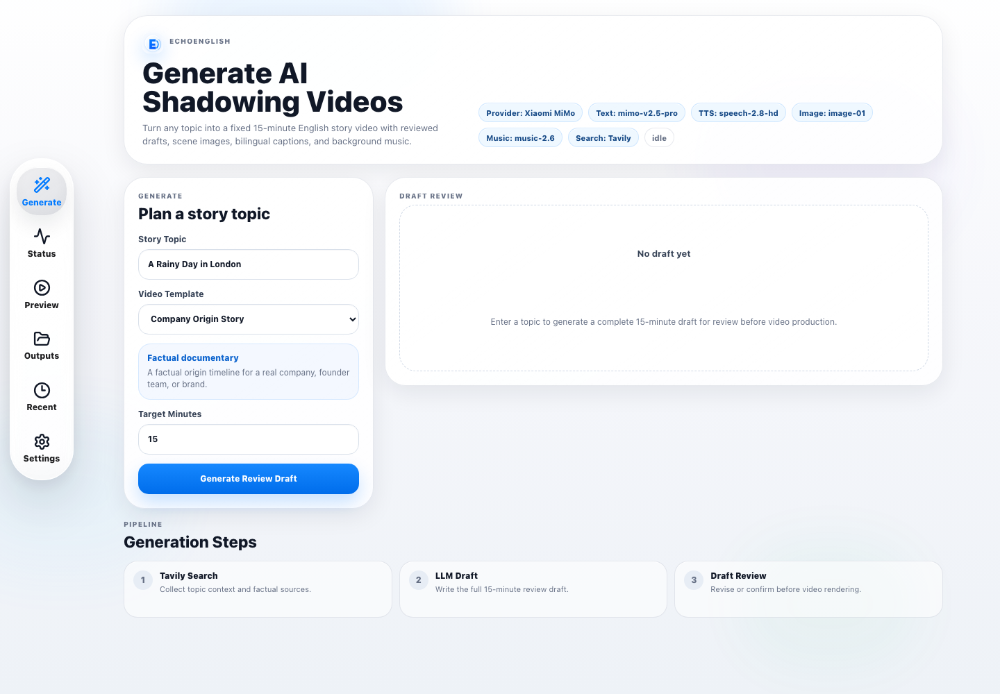
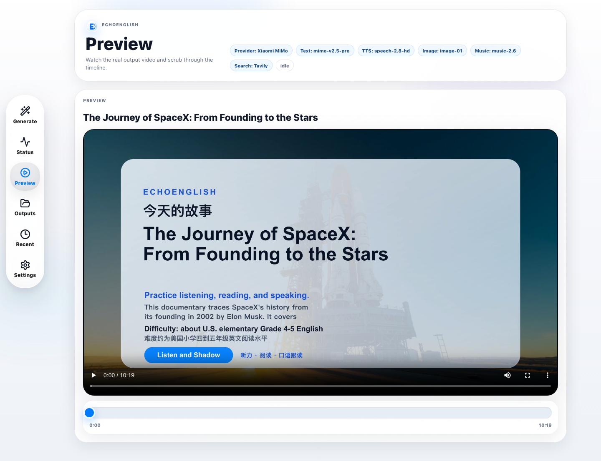
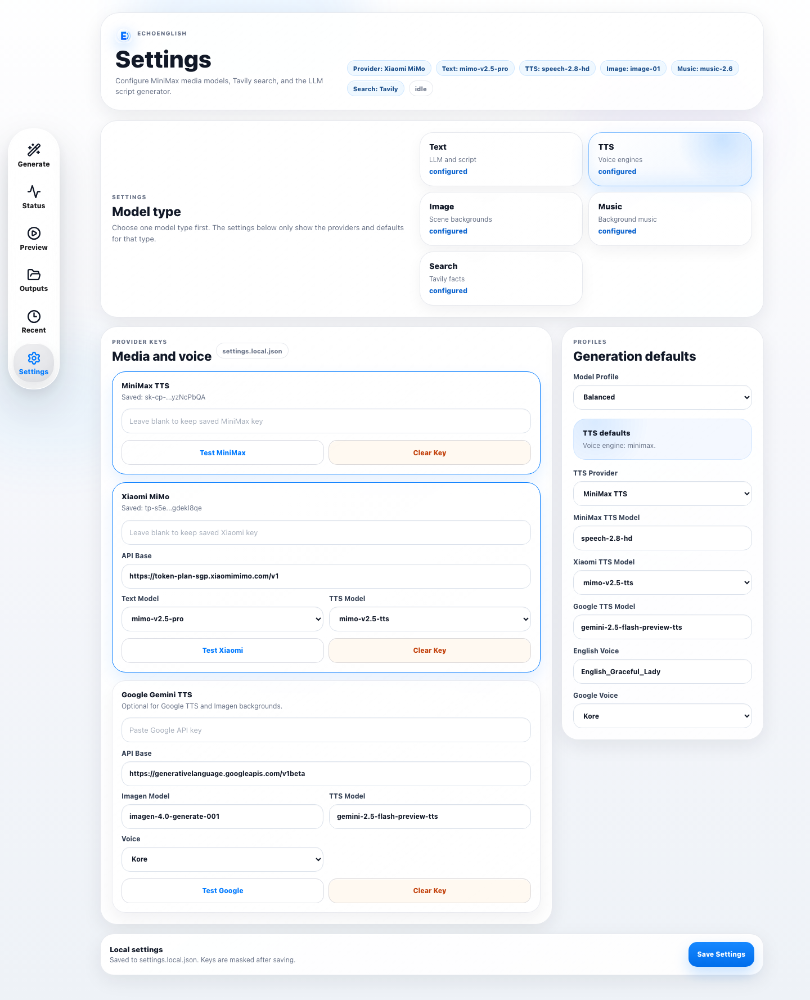
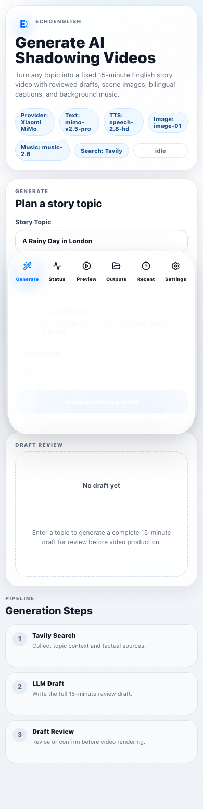

# EchoEnglish

<p align="center">
  
</p>

<p align="center">
  <a href="README_CN.md">中文文档</a>
</p>

EchoEnglish is a local AI workflow for generating English shadowing videos from any topic. It creates a reviewed script, sentence-level narration, story-beat scene images, bilingual captions, vocabulary notes, background music, YouTube publishing copy, and a final MP4.

The dashboard is designed for long 15-minute learning videos, with recoverable generation stages so API quota errors, network failures, or service restarts do not waste completed audio, images, or music.

## Screenshots

### Generate Dashboard



### Video Preview



### Model Settings



### Mobile Layout



## Core Workflow

1. Enter a topic.
2. Choose a video type template.
3. Tavily searches for topic context and factual sources.
4. The LLM creates a complete 15-minute draft.
5. Review the draft, revise with feedback, then confirm generation.
6. EchoEnglish generates narration, scene images, background music, captions, and final MP4.
7. If a stage fails, click Continue Generation to resume from saved manifests.

Generation is tracked as a seven-stage state machine:

```text
draft -> script-assets -> tts -> images -> music -> compose -> quality
```

## Stability V2

EchoEnglish blocks weak scripts before expensive media APIs run:

- Repeated boilerplate scenes, repeated full sentences, repeated endings, missing Chinese translations, and missing vocabulary notes fail the draft quality gate.
- Draft generation uses the local quality gate by default so one good LLM draft can return quickly. Set `ECHOENGLISH_LLM_DRAFT_VALIDATION=1` only if you also want a second LLM judge pass, which is slower.
- Confirmed drafts are checked again before TTS, images, music, and video composition.
- TTS manifests, image manifests, music manifests, and timeline manifests are saved for recovery and debugging.
- The final video timeline is aligned to the real `audio.wav` duration to avoid tail-frame hold or repeated-looking endings.
- Existing outputs can be analyzed from Preview with **Analyze Quality** and repaired with **Create Repair Draft**. Repair drafts are saved to a new output folder and do not overwrite the original video.

Each output folder can include:

```text
outputs/{slug}/
  draft.json
  draft.md
  script.json
  script.md
  subtitles.srt
  audio.wav
  image-prompts.md
  youtube-copy.md
  youtube-copy.json
  audio-manifest.json
  image-manifest.json
  music-manifest.json
  timeline-manifest.json
  timeline-manifest-portrait.json
  quality-report.json
  images/
  music/
  slides/
  final.mp4
  final-portrait.mp4
  job-state.json
```

## Video Types

EchoEnglish supports multiple video modes through templates:

| Template | Mode | Best for |
| --- | --- | --- |
| Company Origin Story | factual documentary | Company history and brand origin videos |
| Product Launch History | factual documentary | Product, car, phone, app, or platform launch stories |
| Founder Biography | factual documentary | Founder or public figure biographies |
| City Travel Story | fictional story | Travel English with real city details |
| School Life Story | fictional story | Beginner school and friendship stories |
| Mystery Adventure | fictional story | Soft mystery and clue-based stories |
| Science And Technology | factual documentary | Science, technology, missions, inventions |
| Daily Life Drama | fictional story | Practical daily-life English |
| Historical Event Documentary | factual documentary | Real events and historical timelines |
| Future Imagination Story | fictional story | Near-future learning stories |
| Podcast Conversation | two-host dialogue | Two-host explainer videos with role-based voices |

### AI Template Generation

When no template is specified, EchoEnglish automatically generates a custom video template using AI based on the topic. The AI analyzes the topic and creates:

- **Content mode**: Factual documentary or fictional story
- **Structure rules**: Narrative arc and story flow guidance
- **Visual style**: Image generation style and mood
- **Vocabulary focus**: Domain-specific B1-level words
- **Search keywords**: For factual context retrieval
- **Draft guidance**: Writing instructions for English learners

This allows users to simply enter a topic (e.g., "Google Company History") and get a complete, customized video template without manual configuration.

Factual templates use search-backed context and are instructed not to invent fictional protagonists, employees, private scenes, or unsupported claims.

## Model Support

Configure models from the Settings page. Keys are saved only in `settings.local.json`, which is gitignored.

| Capability | Supported providers | Notes |
| --- | --- | --- |
| Script LLM | DashScope/Qwen compatible API, Xiaomi MiMo | Xiaomi requests use MiMo-specific chat parameters |
| Search | Tavily | Used before draft generation |
| TTS | MiniMax, Google Gemini TTS, Xiaomi MiMo TTS | Podcast mode supports two host voices |
| Image | MiniMax image-01, Google Imagen | MiniMax prompts are compressed under API length limits |
| Music | MiniMax music-2.6 | Generates 3-4 background tracks and merges them |
| Video encode | FFmpeg CPU/GPU encoders | Auto-detects hardware encoder when available |

### Recommended Setup

MiniMax stack (stable default):

- Text: DashScope/Qwen for long drafts
- TTS: MiniMax `speech-2.8-hd`
- Image: MiniMax `image-01`
- Music: MiniMax `music-2.6`
- Search: Tavily

Xiaomi MiMo stack (proven alternative):

- Text: Xiaomi `mimo-v2.5-pro`
- TTS: Xiaomi `mimo-v2.5-tts` through `POST {ttsBaseUrl}/chat/completions`
- Voice: `mimo_default`, or podcast hosts `Mia` / `Milo`
- Image: MiniMax `image-01` (Xiaomi does not provide an image API)
- Music: MiniMax `music-2.6`

### Xiaomi MiMo TTS Details

MiMo text generation and MiMo TTS are both chat-completions style calls, but they must be configured carefully. The working Token Plan setup verified in this project is:

| Field | Recommended value | Notes |
| --- | --- | --- |
| Main API base | `https://token-plan-sgp.xiaomimimo.com/v1` | Used for MiMo text generation. |
| Text model | `mimo-v2.5-pro` | Normalized internally to `MiMo-V2.5-Pro` for text calls. |
| TTS base | `https://token-plan-sgp.xiaomimimo.com/v1` | Token Plan keys work here. Do not force Token Plan keys to `api.xiaomimimo.com`. |
| TTS model | `mimo-v2.5-tts` | `MiMo-V2.5-TTS` from Settings is normalized to lowercase. |
| Narration voice | `mimo_default` | Podcast mode uses `Mia` and `Milo`. |

The TTS request uses `/chat/completions`, not the legacy `/audio/speech` endpoint:

```text
POST {ttsBaseUrl}/chat/completions
Authorization: Bearer {apiKey}
api-key: {apiKey}
{
  "model": "mimo-v2.5-tts",
  "messages": [{ "role": "assistant", "content": "Text to speak" }],
  "modalities": ["text", "audio"],
  "audio": {
    "voice": "mimo_default",
    "format": "wav"
  }
}
```

Response returns base64 audio at `choices[0].message.audio.data`.

Recommended local settings shape:

```json
{
  "provider": "xiaomi",
  "xiaomi": {
    "apiKey": "tp-...",
    "baseUrl": "https://token-plan-sgp.xiaomimimo.com/v1",
    "textModel": "mimo-v2.5-pro",
    "ttsModel": "MiMo-V2.5-TTS",
    "voice": "mimo_default",
    "podcastHostAVoice": "Mia",
    "podcastHostBVoice": "Milo",
    "ttsBaseUrl": "https://token-plan-sgp.xiaomimimo.com/v1"
  },
  "media": {
    "ttsProvider": "xiaomi"
  }
}
```

The runtime normalizes this to:

```text
textModel: MiMo-V2.5-Pro
ttsModel: mimo-v2.5-tts
tts endpoint: https://token-plan-sgp.xiaomimimo.com/v1/chat/completions
```

Available voices:

| Voice | Use case |
| --- | --- |
| `mimo_default` | General narration |
| `Mia` | Podcast host A (female) |
| `Milo` | Podcast host B (male) |
| `Chloe`, `Dean` | English voices |
| `冰糖`, `茉莉`, `苏打`, `白桦` | Chinese voices |

For TTS, model names must be lowercase on the wire. The Settings page may show `MiMo-V2.5-TTS`, but the backend sends `mimo-v2.5-tts`.

### Google Imagen Notes

Google Imagen uses:

```text
POST {baseUrl}/models/{imageModel}:predict
x-goog-api-key: {apiKey}
```

EchoEnglish parses both SDK-style and REST-style image responses:

- `generatedImages[].image.imageBytes`
- `generatedImages[].image.bytesBase64Encoded`
- `predictions[].bytesBase64Encoded`
- nested base64 image fields

If Google returns `{}` or no image bytes, check that the API key has Imagen access, billing/quota is enabled, and the selected model is available for the key. The default model is `imagen-4.0-generate-001`.

## Quick Start

```bash
npm install
npm run build
PORT=3002 npm run web
```

Open the dashboard:

```text
http://127.0.0.1:3002/generate
```

The server binds to `0.0.0.0`, so LAN URLs are printed at startup. Configure a PIN in Settings before exposing it outside your machine.

> **Port note**: OrbStack on macOS may intercept port 3001. Use `PORT=3002` to avoid conflicts.

## Settings

Open:

```text
http://127.0.0.1:3002/settings
```

Configure:

- MiniMax API key
- Tavily API key
- LLM API base, model, and key
- Xiaomi MiMo key, base URL, text model, TTS model, TTS base URL, TTS API key, default voice, and podcast host voices
- Google API key, Imagen model, Gemini TTS model, and voice
- TTS provider and image provider
- Podcast host A/B voices
- Music track count
- Access PIN
- Video encoder: `auto`, `cpu-libx264`, `apple-videotoolbox`, `nvidia-nvenc`, or `intel-qsv`

Fallback environment variables are also supported:

```bash
export MINIMAX_API_KEY="your_key"
export TAVILY_API_KEY="your_key"
export LLM_API_KEY="your_key"
export LLM_API_BASE="https://coding.dashscope.aliyuncs.com/v1"
export STRIX_LLM="qwen3.6-plus"
export GOOGLE_API_KEY="your_key"
export ACCESS_PIN="159951"
npm run web
```

Never commit `settings.local.json` or real API keys.

## Recovery And Continue

Long video generation can take time and uses many API calls. EchoEnglish writes progress continuously:

- `audio-manifest.json` records sentence audio cache state.
- `image-manifest.json` records every scene image.
- `music-manifest.json` records generated background tracks.
- `job-state.json` records stage state, counts, errors, and recoverability.

When a job fails because of rate limits, quota, timeouts, or service restart, open Status and click Continue Generation. Completed TTS, images, and music are reused.

If a server restart leaves a job marked as `running`, EchoEnglish converts it to a recoverable interrupted job on the next load.

### Image Reuse

Generated images are automatically cached and reused when re-rendering or continuing jobs. The system supports both single images and batch images (for scenes with people):

- Single images: `scene-001-a-01.jpg`
- Batch images: `scene-001-a-01_batch_01.jpg`, `scene-001-a-01_batch_02.jpg`

When continuing a job, existing images are detected and reused without regenerating, saving API calls and time.

### Content Quality

Recent improvements ensure higher quality content:

- **No duplicate milestones**: The system no longer forces scenes to reach a target count, preventing repetitive milestone templates in longer videos.
- **AI-generated templates**: Custom templates are created based on the topic, providing more relevant structure and vocabulary.
- **Better factual content**: Documentary-style videos use search-backed context with real dates, events, and public figures.

## Recent Outputs

The Recent page is a local output manager:

- Preview completed videos.
- Open sidecar files.
- Rename output metadata.
- Delete an output folder.
- See completed, failed, running, and draft directories.

## Batch Image Generation (套图)

Scenes containing people (detected by keywords like person, man, woman, face, portrait, etc.) automatically generate multiple images (up to 4) per scene. The video composer cycles through batch images based on sentence position, creating visual variety for human-focused scenes.

Non-people scenes generate a single image. Batch images are saved with `_batch_` naming:

```text
images/scene-001-a.jpg           # single image (no people)
images/scene-002-a_batch_01.jpg  # batch image 1 (has people)
images/scene-002-a_batch_02.jpg  # batch image 2
images/scene-002-a_batch_03.jpg  # batch image 3
```

Both MiniMax and Google Imagen support batch generation. Configure the image provider in Settings -> Media.

## YouTube Copy

Each generated video includes YouTube publishing copy (`youtube-copy.json` and `youtube-copy.md`) with:

- Title (prefixed with "英语口语练习-")
- Description in English and Chinese
- Chapters with timestamps
- Tags
- Pinned comment in English and Chinese
- Thumbnail text suggestions

The YouTube copy is viewable in the Preview page via the "Show YouTube Copy" button.

## Video UI

Generated videos include:

- Modern, clean title cover with centered layout and blue accent.
- Intro narration describing the topic, practice goal, and level.
- Bilingual captions with English emphasized and Chinese smaller (up to 3 lines for long sentences).
- Current-sentence vocabulary card.
- Orange highlight for matching keywords.
- Final vocabulary review table with word, phonetic spelling, and Chinese meaning.
- Podcast mode with two-host visual layout, two voice roles, and dialogue captions.

### Subtitle Display

Subtitles support up to 3 lines for long sentences with responsive text wrapping:
- Portrait mode: 42 characters per line
- Landscape mode: 52 characters per line
- Automatic font size adjustment for 3-line display

### Cover Design

The video cover features a clean, modern design with:
- White card background for better readability
- Centered blue play button with proper aspect ratio
- Clear typography hierarchy (brand badge, title, description)
- Responsive layout for both portrait and landscape modes

Use Preview -> Re-render Video UI to regenerate only slides and MP4 from existing script/audio/images/music. This does not call LLM, TTS, image, or music APIs.

## Portrait Video Mode (9:16)

EchoEnglish supports portrait/vertical video for mobile platforms (TikTok, Instagram Reels, YouTube Shorts). Every generation or Re-render automatically produces both landscape and portrait videos:

- `final.mp4` — 1920x1080 (16:9 landscape)
- `final-portrait.mp4` — 1080x1920 (9:16 portrait)

Portrait mode reuses the same landscape (16:9) scene images — images are center-cropped (`xMidYMid slice`) to fill the portrait canvas without regenerating.

Layout adjustments in portrait mode:

- Title cover panel is vertically centered with a narrower play button area.
- Vocabulary review uses 2 columns instead of 3.
- Vocabulary overlay moves to top-center instead of top-right.
- Podcast host cards are centered and narrower.
- Caption area is wider (88% of canvas width) with adjusted text wrapping.
- Fallback scene illustrations scale proportionally.

The Preview page shows both videos and provides separate download buttons for landscape and portrait.

## Hardware Video Encoding

Video composition uses FFmpeg. In Settings -> Video, choose:

| Encoder | Best for |
| --- | --- |
| Auto | Recommended default. Detects available hardware encoder. |
| Apple VideoToolbox | macOS hardware H.264 encoding. |
| NVIDIA NVENC | NVIDIA GPU H.264 encoding. |
| Intel Quick Sync | Intel hardware H.264 encoding. |
| CPU libx264 | Reliable software fallback. |

Hardware encoding only speeds up the `compose` stage. It does not speed up LLM, TTS, image generation, or music generation.

Check local FFmpeg support:

```bash
ffmpeg -hide_banner -encoders | grep -E 'h264_videotoolbox|h264_nvenc|h264_qsv|libx264'
```

If a selected hardware encoder fails during export, EchoEnglish automatically retries with CPU `libx264`.

## CLI

The web dashboard is the primary workflow, but CLI generation remains available:

```bash
npm run generate:sample
npm run generate -- --topic "The Lost Key" --minutes 3
npm run generate -- --topic "A Rainy Day in London" --minutes 15
```

## Troubleshooting

### MiniMax image prompt length error

MiniMax image prompts must be shorter than 1500 characters. EchoEnglish now compresses prompts before sending them to MiniMax while preserving the original script and prompt files for review.

### Status appears stuck in Scene Images

Image generation may be slow because a 15-minute video requests about 30-45 story-beat images, normally 2-3 images per minute. The Status page reads `image-manifest.json` and shows counts such as `Images 14/36`. If a request times out, quota is exhausted, or the server restarts, the job becomes recoverable.

### Regenerate only images

Use `POST /api/outputs/{slug}/regenerate-images` to regenerate the current script's story-beat images and re-render MP4 without calling the LLM, TTS, or music APIs. The endpoint backs up existing images first and restores them automatically if the image API fails.

### Draft quality is repetitive

Use the draft review step and revise with feedback before confirming. For factual topics, prefer documentary templates and keep Tavily configured. If Xiaomi text generation is slow or incomplete, switch text generation back to the Qwen-compatible LLM profile.

### Draft generation is slow

The Generate page shows a live draft progress meter for Tavily search, LLM drafting, and the local quality gate. By default EchoEnglish does not run a second LLM self-check because it can double the waiting time and cause long stalls. LLM draft requests time out after 180 seconds by default; override this with `LLM_REQUEST_TIMEOUT_MS=240000` if your selected model is slower. If you explicitly need the extra LLM judge pass, start the server with `ECHOENGLISH_LLM_DRAFT_VALIDATION=1`.

### Manifest returns 401 when external access is enabled

The PWA shell files `manifest.webmanifest`, `sw.js`, `favicon.ico`, and `icons/*` are served without the dashboard PIN so mobile browsers can install the app. APIs and generated outputs still require the configured PIN.

### Video UI changes needed

Use Re-render Video UI from Preview. It reuses existing assets and avoids extra API cost.

### Analyze and repair old outputs

Preview now includes **Analyze Quality** and **Create Repair Draft**:

- `POST /api/outputs/{slug}/analyze-quality` reads `script.json`, `audio-manifest.json`, `image-manifest.json`, `timeline-manifest.json`, and `quality-report.json`.
- It reports repeated draft sections, missing Chinese translations, missing vocabulary notes, image manifest failures, and audio/subtitle/video duration deltas.
- `POST /api/outputs/{slug}/create-repair-draft` creates a new `outputs/{slug}-repair-{timestamp}/draft.json` for review. It does not overwrite the original video.

Every completed render writes:

- `timeline-manifest.json`
- `timeline-manifest-portrait.json`
- `quality-report.json`

The final frame is aligned to the real `audio.wav` duration, so subtitle and video timing should not leave an extra trailing hold. `quality-report.json` marks timing deltas above `0.1s` as warnings and above `0.5s` as `failed-quality`.

### Xiaomi MiMo TTS errors

**404 Not Found**: MiMo Token Plan TTS does not use `/audio/speech`. It uses `/chat/completions` with a messages-based audio payload. Keep `ttsBaseUrl` as a base URL such as `https://token-plan-sgp.xiaomimimo.com/v1`; the backend appends `/chat/completions`.

**401 Unauthorized / Invalid API Key**: Do not send a Token Plan `tp-...` key to `https://api.xiaomimimo.com/v1`. The verified Token Plan combination is `tp-...` key + `https://token-plan-sgp.xiaomimimo.com/v1/chat/completions`. If a separate `sk-...` MiMo key is used, test it in Settings before switching endpoints.

**"Not supported model"**: TTS model names must be lowercase. `MiMo-V2.5-TTS` in Settings is accepted, but the backend sends `mimo-v2.5-tts`.

**Voice "alloy" not found**: MiMo does not have an `alloy` voice. Use `mimo_default` for narration, or `Mia`/`Milo` for podcast hosts.

Quick local TTS smoke test:

```bash
node -e 'const {readLocalSettings}=require("./src/settingsStore"); const {createAudio}=require("./src/xiaomiTts"); (async()=>{const s=await readLocalSettings(); const r=await createAudio({readingItems:[{id:"test",text:"Hello, welcome to EchoEnglish.",ttsText:"Hello, welcome to EchoEnglish.",language:"en",pauseAfterSeconds:0}],outputDir:"/tmp/echoenglish-xiaomi-tts-test",apiKey:s.xiaomi.ttsApiKey||s.xiaomi.apiKey,baseUrl:s.xiaomi.baseUrl,ttsBaseUrl:s.xiaomi.ttsBaseUrl,model:s.xiaomi.ttsModel,voice:"Mia",logs:[]}); console.log(r.provider,r.model,r.audioPath);})()'
```

## Development

```bash
npm run build
node --check src/webServer.js
PORT=3002 npm run web
```

This project intentionally keeps the backend on Node built-in `http` instead of Express.

## Security

- `settings.local.json` is local and gitignored.
- Browser summaries mask saved keys.
- Access PIN can protect local/LAN use.
- Avoid committing generated outputs that include private content.
- Do not paste API keys into public issues, screenshots, or README files.
